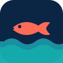

<p align="center"></p>

# Lamer Konekte

**Lapes pli konekte. Desizion pli informe.**

A Morisyen-first, multimodal catch-recording and marine-information assistant for Mauritius's artisanal fishers — built by **Team Ctrl200** for the Gemma 4 hackathon (Multimodal Track, Blue Economy pillar).

## The problem

Artisanal fishing feeds Mauritius, but catch declarations are paper-based, marine information is scattered, regulations reach fishers second-hand, and almost nothing exists in Morisyen — the language fishers actually speak.

## The solution

Three moments, one PWA:

1. **Before the trip** — ask in Morisyen or English; Gemma calls `get_marine_conditions`; waves/swell/SST shown with a mandatory advisory disclaimer.
2. **On the water** — photograph the catch → quality gate (no tokens on bad photos) → constrained Gemma species *suggestion* → **mandatory fisher confirmation** → ruler-measured length → **deterministic, source-attributed rule check**.
3. **Back ashore** — catch log, offline queue, declaration draft (PDF) → clearly labelled **MOCK** ministry endpoint → demonstration receipt.

## Gemma 4's role

Hosted **`gemma-4-26b-a4b-it`** via the official `google-genai` SDK: image understanding, visible characteristics, Morisyen/English intent, structured JSON, and **native function calling** over 12 allow-listed tools with a full tool-response round trip. Gemma never decides legality, never verifies size, never confirms species — humans and deterministic code do.

> **Status:** all ten hosted Gemma gates **PASS on real inference** (`docs/GEMMA_GATES.md`) — image + Morisyen + structured output + native function calling with a completed tool round trip, verified live through the app. Median latency ≈19 s on the current key tier (the UI shows progress states and a latency badge). Without a key the app falls back to a **clearly disclosed** deterministic mock; nothing mocked is ever presented as Gemma inference.

## Architecture

FastAPI (Python 3.12, SQLModel/SQLite) + React/TypeScript PWA (offline-first, IndexedDB queue, service worker), single Docker image. See `docs/ARCHITECTURE.md`, `docs/DATA_FLOW.md`.

## Quick start

> **New to the project? Follow [`docs/SETUP_GUIDE.md`](docs/SETUP_GUIDE.md)** — a verified step-by-step walkthrough (clone → running app in ~5 minutes, no API key needed), with file locations, per-role instructions and troubleshooting. The condensed version:

```bash
# backend
cd backend && python3.12 -m venv .venv && .venv/bin/pip install -r requirements.txt
cp ../.env.example ../.env    # add GEMINI_API_KEY for hosted mode (optional — mock works offline)
# frontend
cd ../frontend && npm install && npm run build
# run (serves API + PWA)
cd ../backend && .venv/bin/uvicorn app.main:app --port 8000
# tests
.venv/bin/python -m pytest tests -q          # 44 tests
# evaluation
cd .. && backend/.venv/bin/python evaluation/run_all.py --provider mock
# hosted Gemma gates (needs key)
backend/.venv/bin/python backend/scripts/run_gemma_gates.py
```

## Dataset & evaluation

60 licensed iNaturalist photos (5 Mauritian species, CC0/CC-BY/CC-BY-NC, full attribution + SHA-256 + leakage-safe splits in `data/manifests/`), synthetic quality-test images, 32-case Morisyen benchmark. Mock-pipeline results: 93.8% intent routing, 100% schema validity, 0 safety failures (`docs/BASELINE_REPORT.md` — honestly labelled, not model-quality numbers).

## Training

QLoRA notebooks (Gemma 4 E2B, multimodal + text modes) with hardware gate and strict acceptance criteria — prepared but **not launched** (no Kaggle auth in-sprint): `docs/TRAINING_PLAN.md`, `scripts/kaggle_push_training.sh`.

## Safety

Suggest-never-declare · deterministic sourced rules with `unknown`-over-invented · unverified AI size can never reach legality · no safe-to-sail verdicts · mock ministry loudly labelled · prompt-injection defence · in-memory images, rounded coordinates, redacted traces. See `docs/RESPONSIBLE_AI.md`, `docs/LIMITATIONS.md`.

## Kaggle & deployment

`kaggle/` holds the demo notebook (runs top-to-bottom, key via Kaggle Secrets, disclosed mock fallback), training notebooks, and the ≤1,500-word writeup. Deployment: `Dockerfile` + `deployment/render.yaml` (`docs/DEPLOYMENT.md`).

## Team Ctrl200

Yuvine (Gemma/schemas/functions) · Sahil (PWA/UX) · Shirish (backend/marine/queue) · Dhanesh (data/rules/training) · fifth member (QA/deployment/writeup). Branch plan: `docs/TEAM_PARALLEL_PLAN.md`.

## Licences

Code: MIT (`LICENSE`). Photos: per-file licences in `data/manifests/species_images.csv` (non-redistributable files are git-excluded and test-enforced). Marine data: Open-Meteo (CC-BY 4.0). Model usage: Gemma Terms.
